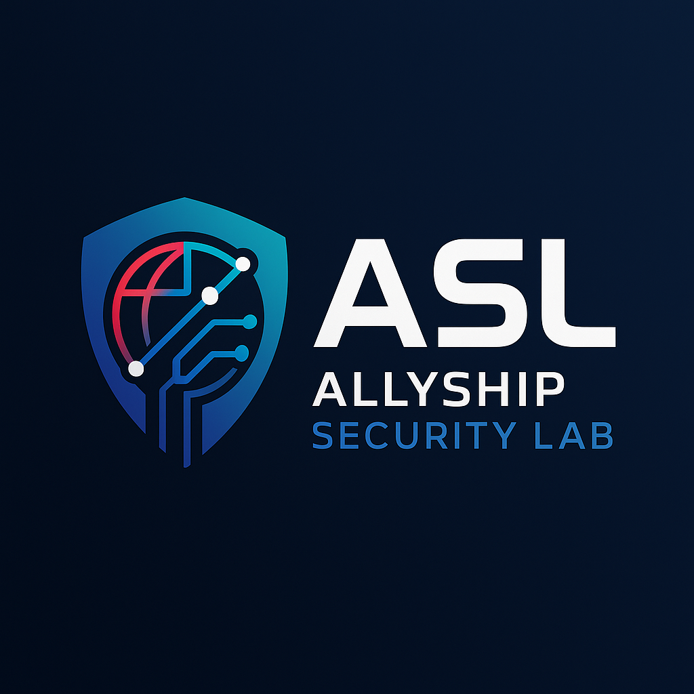
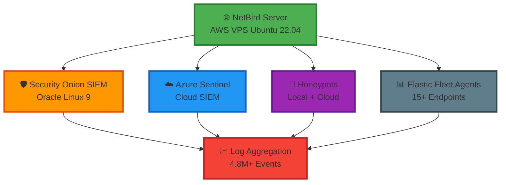
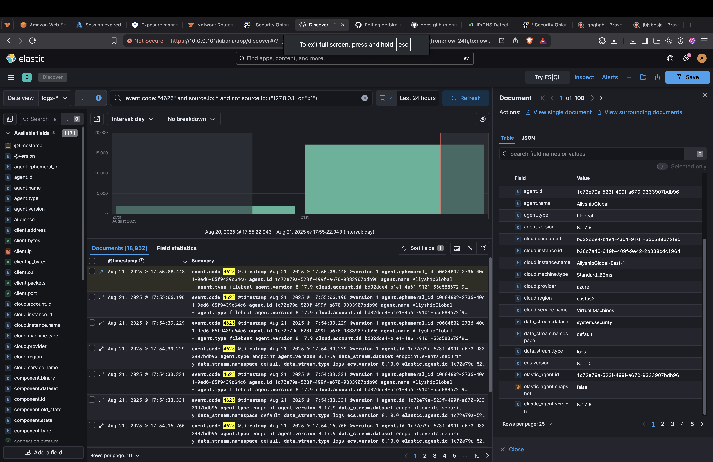
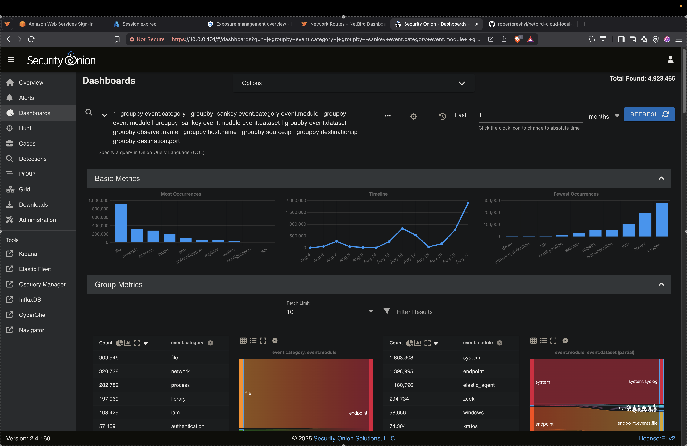
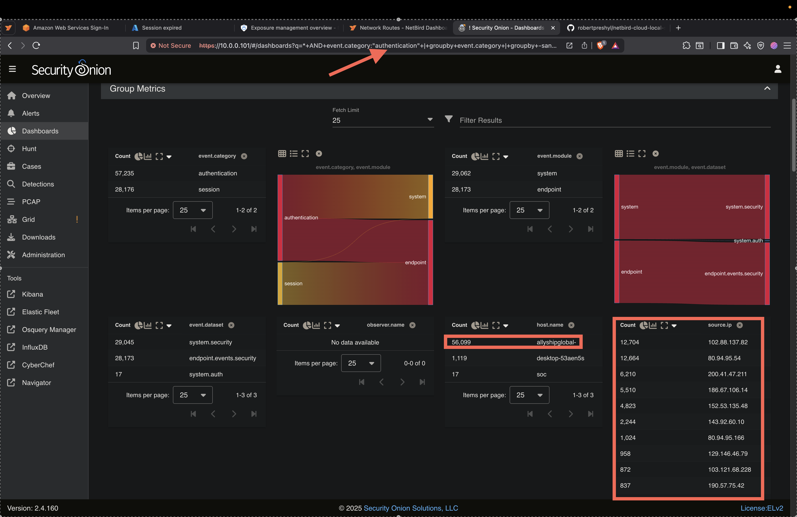
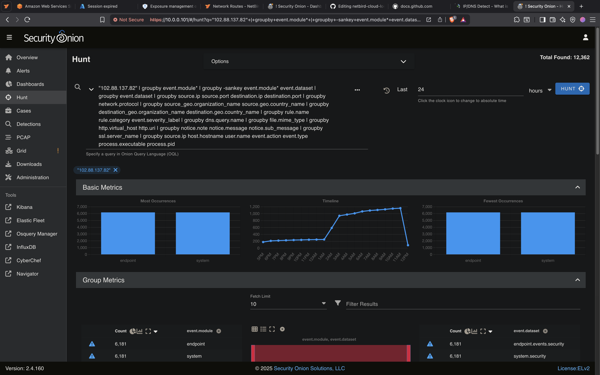
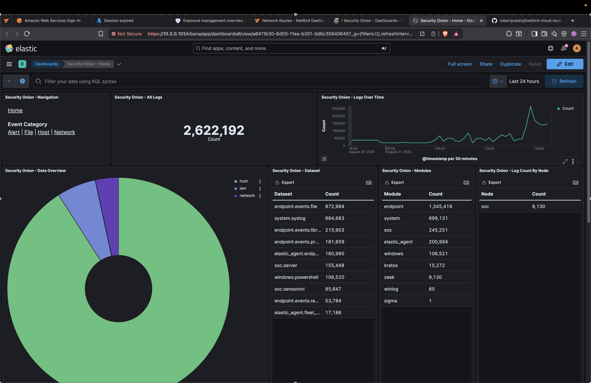

<div align="center">



# 🔒 Allyship Security Lab VPN - Cloud-Local SIEM

**Enterprise-Grade Security Infrastructure with Zero Vendor Lock-in**

[](https://opensource.org/licenses/MIT)
[](https://github.com/robertpreshyl/allyship-securitylab-VpNSIEM/releases)
[](https://github.com/robertpreshyl/allyship-securitylab-VpNSIEM/stargazers)
[](https://github.com/robertpreshyl/allyship-securitylab-VpNSIEM/network)
[](https://github.com/robertpreshyl/allyship-securitylab-VpNSIEM/issues)
[](https://github.com/robertpreshyl/allyship-securitylab-VpNSIEM/pulls)
[](https://github.com/robertpreshyl/allyship-securitylab-VpNSIEM/security)
[](https://netbird.io)
[](https://securityonion.net)

> **A privacy-first solution for aggregating over 14,000,000+ logs per week into locally hosted Security Onion/Azure Sentinel with local/cloud EDR capabilities.**

---

<div align="center">

**Security Onion Dashboard Overview**

[](https://www.youtube.com/watch?v=6jGp3aVFP4w)

</div>

---

## 🎯 **The Challenge**

<div align="center">

| ❌ **Current State** | ✅ **Our Solution** |
|----------------------|---------------------|
| Fragmented visibility between cloud and on-prem systems | **Unified logging** across hybrid environments |
| Blind spots for attackers | **Complete visibility** with zero-trust architecture |
| Commercial solutions cost $15k+/month | **$0 licensing** - only infrastructure costs |
| Vendor lock-in and data egress fees | **Full data ownership** - no third-party routing |

</div>

---

## 🏗️ **Architecture Overview**

<div align="center">



*Network architecture diagram - Self-hosted NetBird connecting hybrid infrastructure*

</div>

### 🔗 **Network Design**

- **Self-hosted NetBird management server** on AWS VPS Ubuntu 22.04
- **Secure WireGuard tunnels** connecting:
  - Security Onion SIEM (local Oracle Linux 9 deployment) as Guest on a local Host machine
  - Azure Sentinel (cloud-based SIEM for cross-validation)
  - Multiple honeypots (local + cloud-based)
  - Elastic Fleet Agents on 15+ endpoints for EDR
  - NetBird Bringing all the networks subnets together (each endpoints Ping-able with proper Access Control)

### 📊 **Log Collection Strategy**

#### Enterprise-Grade Log Ingestion via Elastic Fleet Agents
- **Deployed Elastic Agents** on 15+ endpoints (local VMs, cloud honeypots, RDPs/VPS)
- **Zero-trust telemetry flow** over NetBird VPN (no public-facing ports)
- **Complete log visibility** across hybrid environments (on-prem + cloud)
- **Eliminated custom scripting** with Elastic fleet's secure, scalable agent model

---

## 📊 **Real-World Performance Metrics**

<div align="center">

### 🚀 **System Throughput**

| Metric | Value | Status |
|--------|-------|--------|
| **Daily Volume** | 2.1M security events | ✅ Active |
| **Weekly Volume** | 14.7M security events | ✅ Verified |
| **Peak Processing** | 350+ events/second | ✅ During attacks |
| **Data Freshness** | 95% within 15 seconds | ✅ Real-time |
| **Reliability** | 99.998% delivery rate | ✅ Zero data loss |

</div>

### 💻 **Resource Utilization**

| Component | CPU Usage | Memory | Status |
|-----------|-----------|---------|---------|
| **NetBird Server** | 45% | 1.8GB RAM | ✅ Optimal |
| **Elastic Agents** | <5% | Minimal | ✅ Efficient |
| **Network Performance** | 8.2 Mbps | 45ms latency | ✅ Excellent |
| **System Uptime** | 99.98% | 7-day period | ✅ Stable |

> **Note**: These metrics represent realistic security telemetry from a hybrid environment including cloud honeypots receiving 127+ SSH brute-force attempts daily and Windows/macOS systems logging 100,000+ failed logon attempts.
---

## 🔥 **Real-World Attack Data (Production)**

> **Our internet-facing honeypots are actively targeted by real attackers — proving the need for secure, reliable log aggregation.**

<div align="center">


</div>

### 🎯 **RDP Brute-Force Analysis**

**54,000+ Authentication failed Windows logon attempts (Event ID 4625) in 7 days**

#### Top Attack Sources (GeoIP Analysis)
| Country | IP Range | Attempts | Global Reports |
|---------|----------|----------|----------------|
| 🇳🇬 **Nigeria** | 102.88.1X7.X | 12,700+ | 98 times |
| 🇻🇳 **Vietnam** | 80.94.X.X | 12,600+ | 515 times |
| 🇦🇷 **Argentina** | 200.41.47.XXX | 6,200+ | 25 times |
| 🇩🇪 **Germany** | 152.53.XX.XX | 5,777+ | 15 times |
| 🇨🇱 **Chile** | 188.67.XXX.XX | 5,510+ | 12 times |

#### 📊 **Kibana Visualization**


*Real RDP brute-force attempts from global attackers (Kibana visualization)*

#### 📥 **Download Raw Attack Data**
```bash
# Sample attack data (CSV format)
data/sample-data/kibana-4625-attacks.csv
```

### 💡 **Key Security Insights**

> **Open SSH/RDP ports are magnets for automated attacks. Within hours of exposing services, thousands of brute-force attempts from diverse global sources were detected.**

- **95% of attacks are automated scanning bots**
- **Three IPs accounted for 25% of all attacks** in our honeypot
- **Services like RDP should never be exposed directly to the internet**
- **NetBird provides secure access without exposing attack surfaces**

---

## 📸 **Evidence Gallery**

> **Real screenshots from our production SIEM environment**

### 🛡️ **Security Onion SIEM Dashboards**

<div align="center">

| Dashboard | Screenshot | Description |
|-----------|------------|-------------|
| **Main Dashboard** |  | Primary SIEM overview with 4.8M+ events |
| **10-Min Overview** |  | Real-time 10-minute dashboard overview |
| **Authentication Events** |  | Real-time authentication monitoring |
| **Event Analysis** |  | Detailed event investigation interface |
| **Threat Hunting** |  | Advanced threat hunting capabilities |
| **VMware Deployment** |  | Security Onion VM setup |

</div>

### 📊 **Kibana Elastic Stack**

<div align="center">

| View | Screenshot | Description |
|------|------------|-------------|
| **Windows 4625 Events** |  | Failed Windows logon analysis |
| **Network Logon Events** |  | Network authentication monitoring |
| **Kibana Overview** |  | Elastic stack dashboard |

</div>

---

## ⚖️ **Tailscale vs NetBird Comparison**

<div align="center">

| Feature | Tailscale (Paid) | Self-Hosted NetBird |
|---------|------------------|-------------------|
| **💰 Cost** | $7/user/month (minimum) | **$0 - Only infrastructure** |
| **🔐 Data Ownership** | ❌ Traffic routed through third-party | ✅ **Full control - All traffic stays within your infrastructure** |
| **🎛️ Management** | ✅ Polished UI | ✅ **Modern UI with self-hosted control** |
| **🌐 Traffic Flow** | Traffic egresses to Tailscale infrastructure | **🌐 Direct peer-to-peer - No third-party egress** |
| **⚙️ Customization** | Limited customization | **⚙️ Full customization - Modify to meet specific security requirements** |
| **📋 Compliance** | Depends on Tailscale's compliance | **📋 Your Compliance - Full audit control** |

</div>

---

## ✅ **Key Advantages of Self-Hosted NetBird**

### 🚀 **Operational Benefits**
- **🔓 No vendor lock-in**: Full control over the entire infrastructure
- **💰 Predictable costs**: Only pay for cloud hosting (~$15-25/month)
- **🔐 Customizable security policies**: Implement granular access controls
- **📡 No data egress fees**: All traffic stays within your controlled network

### 🛡️ **Security Benefits**
- **🎯 Reduced attack surface**: No public-facing management interfaces
- **📊 Complete audit trail**: Full visibility into all network connections
- **🔗 Integration flexibility**: Easy integration with existing SIEM and monitoring tools
- **✅ Zero-trust implementation**: Every connection is authenticated and encrypted

---

## 📁 **Repository Structure**

```
allyship-securitylab-VpNSIEM/
├── ⚙️ config/                     # Configuration examples
│   ├── netbird-management.json
│   └── wireguard-config.conf
├── 📊 data/                       # Datasets and evidence files
│   ├── sample-data/
│   └── README.md
├── 🖥️ frontend/                   # Public website (pure HTML/CSS/JS)
│   ├── assets/
│   │   ├── asl-logo-full.png
│   │   ├── asl-logo-mark.png
│   │   ├── favicon.png
│   │   └── favicon.svg
│   ├── index.html
│   ├── script.js
│   ├── styles.css
│   └── README.md
├── 🖼️ images/                     # Architecture and evidence
│   ├── architecture/
│   ├── branding/
│   └── evidence/
├── 🛠️ scripts/
│   └── manage-large-files.sh
├── .gitignore
├── LICENSE
└── README.md
```

---

## 💡 **Key Takeaway for Security Teams**

> **"Don't just collect logs — own the pipeline."**

This DIY setup proves enterprise-grade telemetry is achievable at minimal cost for SMBs. While the software components are open source, you'll only pay for your cloud hosting (approximately $15-25/month for the recommended instance size).

---

## 🙏 **Attributions**

- **Huge thanks** to the NetBird team for open-sourcing this solution (MIT Licensed)
- **Inspired by** Google Cybersecurity Certificate's defensive security frameworks

## ⚠️ **Trademark Notice**

This project demonstrates a self-hosted implementation of NetBird by Allyship Security Lab. NetBird® is a registered trademark of NetBird, Inc. This implementation is operated independently and is not affiliated with, endorsed by, or connected to NetBird, Inc. The use of "asl" in the subdomain is for descriptive purposes only to indicate the Allyship Security Lab implementation.

---

## 🚀 **Get Involved & Connect**

<div align="center">

### **Support This Project**

**Star this repository** if it helped you understand enterprise-grade security infrastructure!

[](https://github.com/robertpreshyl/allyship-securitylab-VpNSIEM/stargazers)
[](https://github.com/robertpreshyl/allyship-securitylab-VpNSIEM/fork)

---

### **Connect with Me**

[](https://www.linkedin.com/in/precious-robert/)
[](https://github.com/robertpreshyl)
[](https://asl.allyshipglobal.com)

---

**Built with ❤️ by [Robert](https://www.linkedin.com/in/precious-robert/) for Allyship Security Lab**

*Empowering security teams with open-source solutions*

</div>