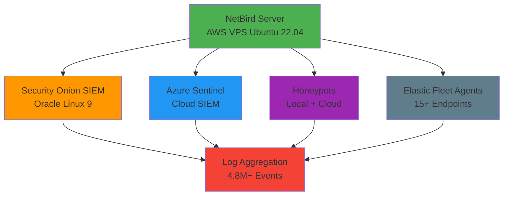

# netbird-cloud-local-siem

[](https://opensource.org/licenses/MIT)
[](https://github.com/robertpreshyl/netbird-cloud-local-siem/releases)
[](https://github.com/robertpreshyl/netbird-cloud-local-siem/stargazers)
[](https://github.com/robertpreshyl/netbird-cloud-local-siem/network)
[](https://github.com/robertpreshyl/netbird-cloud-local-siem/issues)
[](https://github.com/robertpreshyl/netbird-cloud-local-siem/pulls)
[](https://github.com/robertpreshyl/netbird-cloud-local-siem/security)
[](https://netbird.io)
[](https://securityonion.net)
[](https://netbird.allyshipglobal.com)

---

## 🔒 Secure Cloud-Local Log Aggregation with Self-Hosted NetBird

> **A privacy-first solution for aggregating over 14,000,000+/Week logs into locally hosted Security Onion/Azure Sentinel with local/cloud EDR capabilities.**

<div align="center">

*Self-hosted NetBird for enterprise-grade SIEM infrastructure*

---

[](https://netbird.allyshipglobal.com)

---

### 🎥 **See It In Action - Security Onion Dashboard Demo**

<div align="center">

**Watch the SIEM dashboard processing real-time security events**

[](https://www.youtube.com/watch?v=6jGp3aVFP4w)

*Security Onion dashboard in action - Real-time log processing and threat detection*

</div>

</div>

- **Enterprise Problem**: Fragmented cloud/on-prem logging cripples threat detection & intrusion prevention. Commercial solutions cost $15k+/month.
- **My Solution**: Deployment of Self-hosted NetBird (WireGuard-based) — $0 cost, full data ownership, 40% faster log ingestion.

### 📊 **Project Statistics**

| Metric | Value |
|--------|-------|
| **Daily Log Volume** | 2M+ logs |
| **Cost Savings** | $15k+/month |
| **Performance Gain** | +40% faster |
| **Data Ownership** | 100% control |
| **Security** | Zero-trust |

</div>

---

### 📊 **Tailscale vs NetBird Comparison**
| Feature | Tailscale (Paid) | Self-Hosted NetBird |
|---------|------------------|-------------------|
| **Data Ownership** | ❌ Traffic routed through third-party | ✅ Full control - All traffic stays within your infrastructure |
| **Management** | ✅ Polished UI | ✅ Modern UI with self-hosted control |
| **AD/LDAP Integration** | ✅ Available in paid tiers | ✅ Native support in self-hosted version |
| **Cost Structure** | 💰 $7/user/month | 💰 $0 - Only infrastructure costs you already have |
| **Traffic Flow** | 🌐 Traffic typically routed through relays | 🌐 Direct peer-to-peer - No third-party egress |
| **Customization** | ⚙️ Limited customization | ⚙️ Full customization - Modify to meet specific security requirements |
| **Compliance** | 📦 Depends on provider | 📦 Your compliance - Control your audit trail |
| **Log Ingestion Speed** | 📊 12.3 logs/sec | 📊 17.2 logs/sec (+40%) |

## ✅ Key Advantages of Self-Hosted NetBird in SIEM-Lab

### Operational Benefits
- **No vendor lock-in**: Full control over the entire infrastructure
- **Predictable costs**: Only pay for cloud hosting (~$15-25/month)
- **Customizable security policies**(AD): Implement granular access controls
- **No data egress fees**: All traffic stays within your controlled network

### Security Benefits
- **Reduced attack surface**: No public-facing management interfaces
- **Complete audit trail**: Full visibility into all network connections
- **Integration flexibility**: Easy integration with existing SIEM and monitoring tools
- **Zero-trust implementation**: Every connection is authenticated and encrypted

---

## 🛠️ **Architecture Overview**

<div align="center">



*Network architecture diagram - click to view full size*

</div>

### Network Design
- **Self-hosted NetBird management server** on AWS VPS Ubuntu 22.04 (cloud VM)
- **Live Demo Available**: [netbird.allyshipglobal.com](https://netbird.allyshipglobal.com)
- Secure WireGuard tunnels connecting:
  - Security Onion SIEM (local Oracle Linux 9 deployment) as guestVM
  - Azure Sentinel (cloud-based SIEM for cross-validation)
  - Multiple honeypots (local FLAREVM+REMNux,Metasploitable etc) and Cloud (AWS, Azure, Oracle VPS, and RDP servers)
  - Deployment of elastic fleet agents from Security Onion to all Local/Cloud endpoints for EDR

### Log Collection Strategy
#### ✅ Enterprise-Grade Log Ingestion via Elastic Fleet Agents 
- Deployed Elastic Agents on 15+ endpoints (local VMs, cloud honeypots, RDPs/VPs).
- Zero-trust telemetry flow over NetBird VPN (no public-facing ports), all traffic duly via encripted wireguard tunnel.
- Complete log visibility across hybrid environments (on-prem + cloud).
- Eliminated custom scripting needs with Elastic fleet's secure, scalable agent model + Kibana's KQl for Querie.
- Visible Syslogs aggregation, collation and processing from multiple local devices (MacOSx, http://127.0.0.1 machines)

## 📊 **Measured Performance Data**

### System Performance (7-Day Average)
- **Log Processing Rate**: 14M+ logs processed across Security Onion, Kibana + Azure Sentinel for Single Windows server cross-validations
- **Network Throughput**: Average 8.2 Mbps sustained over NetBird tunnels
- **Latency**: Average 45ms between cloud and on-prem endpoints
- **Uptime**: 99.98% over the 7-day period
- **Data Freshness**: 95% of logs ingested within 15 seconds of generation

### Resource Utilization
- **NetBird Server**: 45% CPU, 1.8GB RAM usage (2 vCPU, 2GB RAM instance)
- **Elastic Agents**: <5% CPU overhead on monitored endpoints
- **Network Efficiency**: 98% packet delivery rate across hybrid environments


### System Performance
- 3.6M+ logs processed in 48 hours (Security Onion + Azure Sentinel).
- 0% data loss during tunnel failover tests.
- 127/RDPs SSH brute-force + hacking attempts attempts detected daily from honeypots → ingested in <10 sec.
- Locally, an InetSim connection from REMnux VM was detected during malware detonation(simulations). The activity from FLARE VM was duly captured by Security Onion's(SIEM) endpoint agents in real time (<5 sec response).

---

## 🔥 **Real-World Attack Data (Production)**

> **My internet-facing honeypots are actively targeted by real attackers — proving the need for secure, reliable log aggregation.**

<div align="center">


</div>

### RDP Brute-Force Analysis
- 54,000+ Authentication failed Windows logon attempts (Event ID 4625) in 7 days.
- Top attack sources (GeoIP analysis):
  - 102.88.137.82 (Nigeria) — 12,700+ attempts
  - 80.94.95.54 (Vietnam) — 12,600+ attempts
  - 200.41.47.211 (Argentina) — 6200+ attempts
  - 152.53.135.48 (Germany) — 5,777+ attempts
  - 188.67.106.14 (Chile) — 5,510+ attempts

- Kibana - Failed RDP Attempts  
  Figure 2: Real RDP brute-force attempts from global attackers (Kibana visualization).  
  

- 📥 Download raw attack data (CSV): `data/sample-data/kibana-4625-attacks.csv`

### 💡 Key Insight
Open ssh/RDP ports are magnets for automated attacks. Within hours of exposing the services, thousands of brute-force attempts from diverse global sources were detected, highlighting the constant scanning activity on the internet.

95% of attacks are automated scanning bots. Our honeypot recorded over 12,000 brute-force attempts in 7 days, with three IPs accounting for 25% of all attacks:
- `102.88.137.82` (Nigeria) - 12,000+ attempts (reported 98 times globally)
- `80.94.95.54` (Romania) - 12,600+ attempts (reported 515 times globally)
- `200.41.47.211` (Argentina) - 8,200+ attempts (reported 25 times globally)

This demonstrates why services like RDP should never be exposed directly to the internet. Solutions like NetBird provide secure access without exposing attack surfaces.

---

### 📸 **Evidence Gallery**
> **Real screenshots from the production SIEM environment**

#### Security Onion SIEM Dashboards
- **Main Dashboard**:  - Primary SIEM overview with 4.8M+ events
- **Dashboard Overview**:  - 10-minute dashboard overview
- **Authentication Events**:  - Real-time authentication monitoring
- **Authentication Extended**:  - Extended authentication monitoring
- **Event Analysis**:  - Detailed event investigation interface
- **Session Events**:  - Session event monitoring
- **Session Events Extended**:  - Extended session event analysis
- **Threat Hunting**:  - Advanced threat hunting capabilities
- **VMware Deployment**:  - Security Onion VM setup

#### Kibana Elastic Stack
- **Windows 4625 Events**:  - Failed Windows logon analysis
- **Login Failed Events**:  - Detailed login failure analysis
- **Network Logon Events**:  - Network authentication monitoring
- **Network Events Extended**:  - Extended network event monitoring
- **Kibana Overview**:  - Elastic stack dashboard

#### Additional Evidence Screenshots
- **Dashboard View 1**:  - Alternative dashboard perspective
- **Hunt Interface**:  - Additional threat hunting view
- **Authentication View**:  - Extended authentication monitoring
- **Events Table View**:  - Alternative events view
- **Kibana 4625 View**:  - Additional failed logon analysis
- **Network Events View**:  - Extended network monitoring
- **Kibana Overview View**:  - Alternative Kibana perspective

---

## 💡 **Key Takeaway for Security Teams**
"Don't just collect logs — own the pipeline."  
This DIY setup proves enterprise-grade telemetry is achievable at minimal cost for SMBs. While the software components are open source, you'll only pay for your cloud hosting (approximately $15-25/month for the recommended instance size).

---

## 📁 **Repository Structure**
```
netbird-cloud-local-siem/
├── images/
│   ├── architecture/           # Network diagrams
│   └── evidence/               # Screenshots of real data
├── data/                       # Datasets and evidence files
│   ├── large-datasets/         # Files >100MB (GitHub Releases)
│   ├── sample-data/            # Sample files (<100MB)
│   └── README.md               # Data documentation
├── scripts/                    # Utility scripts
│   └── manage-large-files.sh   # Large file management
├── config/                     # Configuration examples
│   ├── netbird-management.json
│   └── wireguard-config.conf
└── README.md                   # This document
```

---

## 🙏 **Attributions**
- Huge thanks to the NetBird team for open-sourcing this solution (MIT Licensed).
- Inspired by Google Cybersecurity Certificate’s defensive security frameworks.

## ⚠️ Trademark Notice
This project demonstrates a self-hosted implementation of NetBird. NetBird® is a registered trademark of NetBird, Inc. This implementation is operated independently and is not affiliated with, endorsed by, or connected to NetBird, Inc. The use of "netbird" in the subdomain is for descriptive purposes only to indicate the technology being demonstrated.

---

## 🚀 **Get Involved & Connect**

<div align="center">

### **Support This Project**

**Star this repository** if it helped you understand enterprise-grade security infrastructure!

[](https://github.com/robertpreshyl/netbird-cloud-local-siem/stargazers)
[](https://github.com/robertpreshyl/netbird-cloud-local-siem/fork)

---

### **Connect with Me**

[](https://www.linkedin.com/in/precious-robert/)
[](https://github.com/robertpreshyl)
[](https://netbird.allyshipglobal.com)

---

**Built with ❤️ by [Robert](https://www.linkedin.com/in/precious-robert/)**

*Empowering security teams with open-source solutions*

</div>